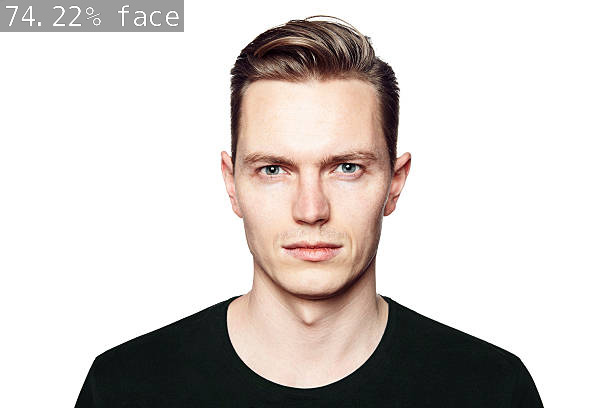
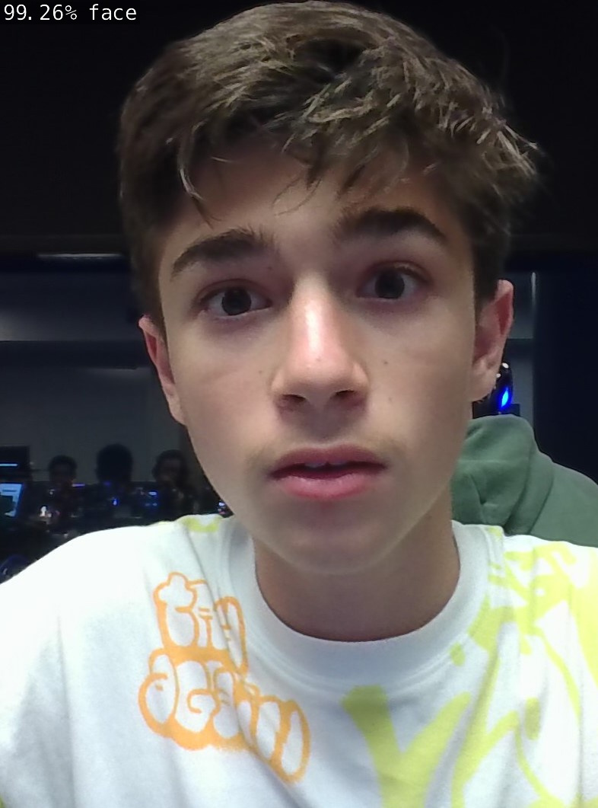
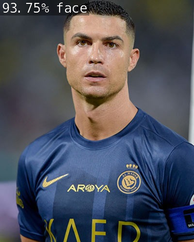
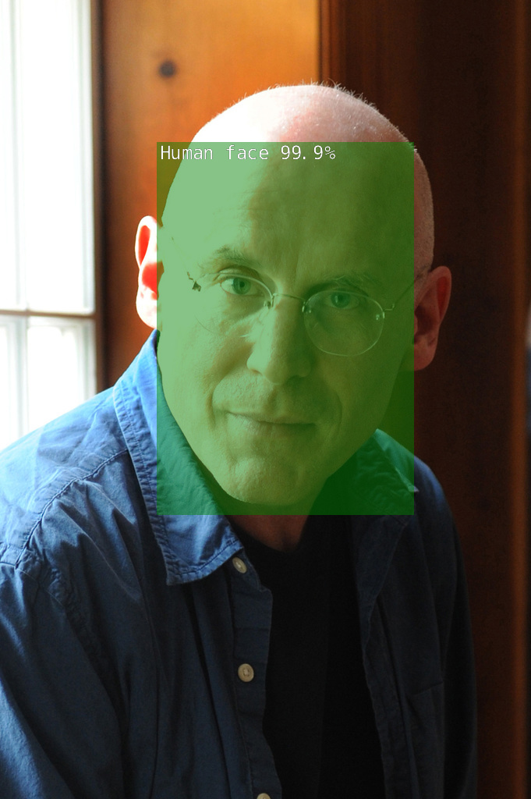
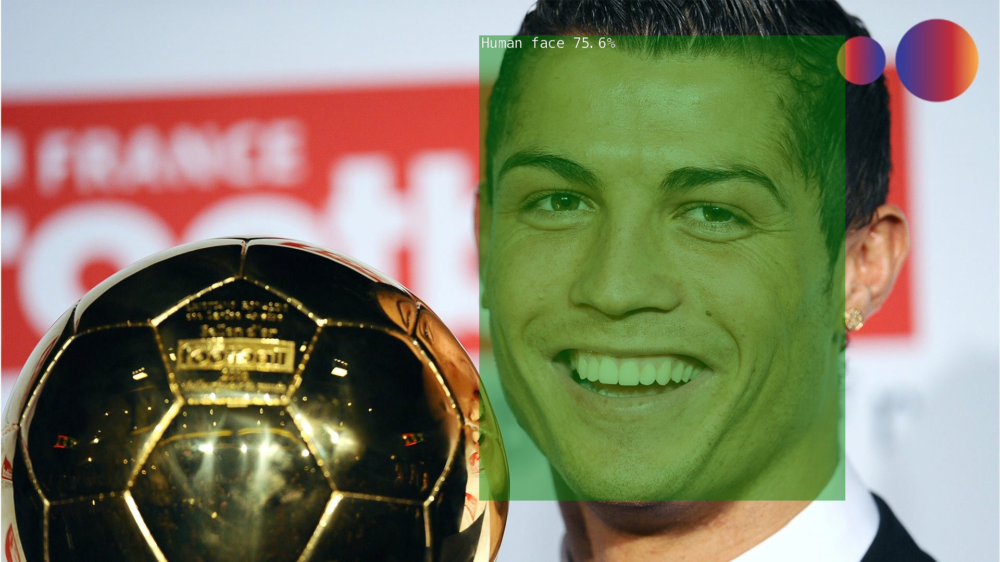
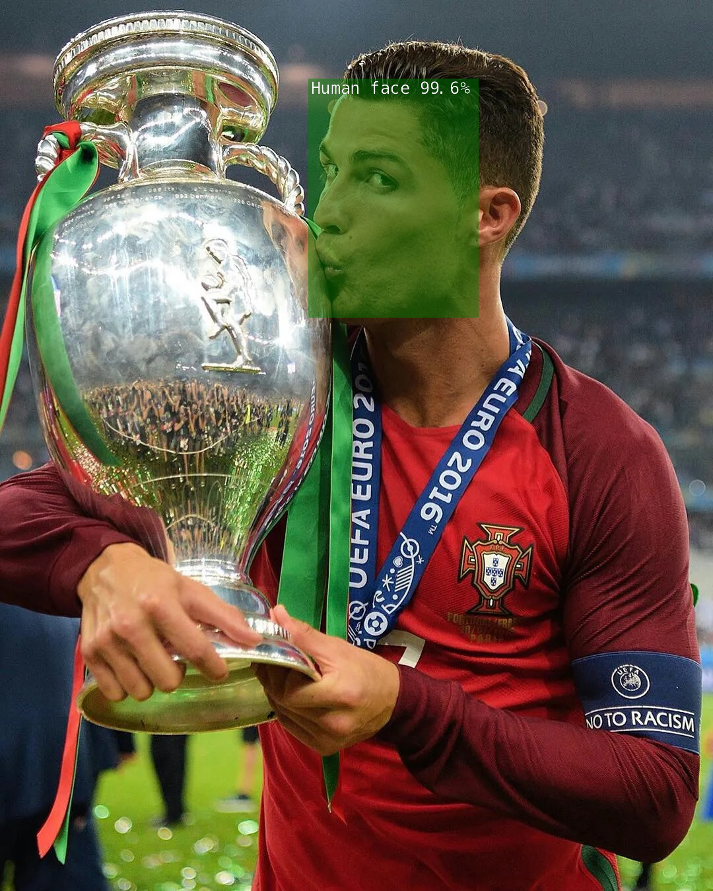
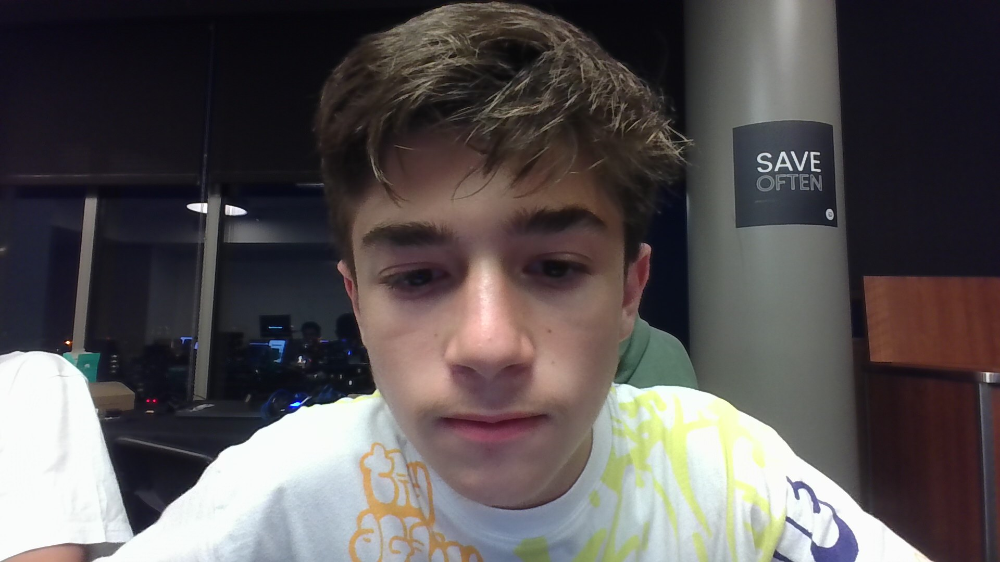
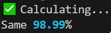

# Compare-Faces

 This project has three uploaded models: 
1. `face_noface`
2. `humanfaces`
3. `comparenet`

## Face_NoFace

### Desciption

This is **classification network**, so it can say is there a face or something else (not face). It is trained and validated on about 200k images of human faces from [VGGFace2](https://www.kaggle.com/datasets/hearfool/vggface2) and [WIDER FACE](https://shuoyang1213.me/WIDERFACE/).

### Examples

<div style="display:flex; flex-direction:row;align-items:flex-start;">
    
    
    
</div>

### Installation & Usage

I will run network on [Nvidia Jetson Orin Nano](https://www.nvidia.com/en-us/autonomous-machines/embedded-systems/jetson-orin/nano-super-developer-kit/) for running Face_NoFace model.

1. Download Face_NoFace `model.onnx` and `labels.txt` from [here](https://github.com/IskDava/Compare-Faces/releases/tag/Face_NoFace_v1.0.0)
2. Move to your classification folder:
```Bash
cd ~/jetson-inference/python/training/classification
```
3. Put them in folder one folder (e.g. face_noface)<br>
You should have something like this:
```
classification/
...
├── face_noface (or any other name)/
│   ├── labels.txt
│   └── model.onnx
├── image.jpg
...
```
4. Now we will start our model. You should write this into terminal:
```Bash 
imagenet.py \ 
  --model=face_noface/model.onnx \ # showing where is face_noface model
  --labels=face_noface/labels.txt \ # showing where are labels
  --input_blob=input_0 \ 
  --output_blob=output_0 \ 
  image.jpg \ # or any other name where are your image 
  output.jpg # where you want to put new image
```
5. Congrats! Your new image is `output.jpg`.

### Possible issues

Network is trained for cropped faces, so if they are far away or there are some other items, it may mistake. Also it can't work with some types of images like .webp

## HumanFaces

### Description

This is **detection network** that work on faces, so it will highlight all faces it can see. It is trained on 20k photos from [Open Images (Human faces class)](https://storage.googleapis.com/openimages/web/visualizer/index.html?set=train&type=detection&c=%2Fm%2F0dzct) 

### Examples

<div style="display:flex; flex-direction:row;align-items:flex-start;">
    
    
    
</div>


### Installation & Usage

This guide be a bit simillar to Face_NoFace's one.

1. Download HumanFace [here](https://github.com/IskDava/Compare-Faces/releases/tag/HumanFacesv1.0.0)
2. Move to your classification folder:
```Bash
cd ~/jetson-inference/python/training/detection/ssd
```
3. Put them in folder one folder (e.g. face_noface)<br>
You should have something like this:
```
ssd/
...
├── HumanFaces/
│   ├── labels.txt
│   └── model.onnx
├── image.jpg
...
```
4. Now we will start our model. You should write this into terminal:
```Bash 
detectnet \ 
  --model=models/humanfaces/ssd-mobilenet.onnx \ # showing where is the model         
  --labels=models/humanfaces/labels.txt  \ # showing labels
  --input-blob=input_0  \ # telling input type
  --output-cvg=scores  \ 
  --output-bbox=boxes \ # telling output type
  input.jpg \ # input (can be video as well)
  output.jpg # output
```
5. Congrats! Your new image is `output.jpg`.

### Possible issues

Like other models this model can't work with some types of images like .webp


## CompareNet

This isn't my own network, I did it with face_recognition python's library. Here you can compare to images with faces and programm will return if they are same or not and its confidence.

## Examples

<div style="display:flex; flex-direction:row;align-items:flex-start;">
    
    
</div>

<div style="text-align:center; margin-top: 10px;">
    
</div>

## Installation & Usage

This quide is much easier and prettier than others.

1. 